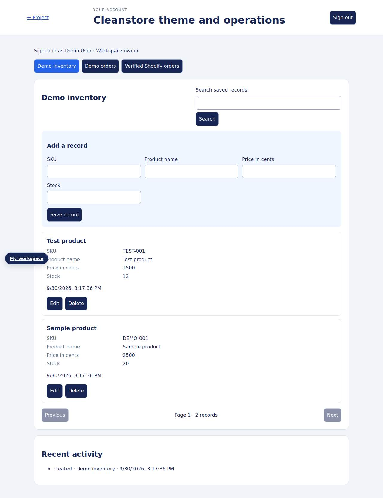

# Cleanstore theme and operations — full-stack project

Package the Shopify theme and manage inventory, calculated demo orders, and verified webhook events in a separate Node service.

**Frontend:** Shopify Liquid, CSS, and JavaScript. **Backend:** Node.js 24, HTTP API, SQLite, and account sessions.

The original Liquid storefront remains on Shopify. The separate companion application reserves stock transactionally, calculates demo order prices, and accepts verified order events with persistent replay protection.

## Run locally

```bash
npm run start:api
```

Open <http://localhost:4000>, choose **Sign in · Account**, and create your local owner account. **My workspace** opens the stored workflows. The first account manages owner-only resources; later accounts receive member access and private account data.

## Implementation

- Salted scrypt password hashes, rotated HttpOnly sessions, seven-day expiry, and owner/member roles.
- SQLite-backed `products`, `orders`, `webhook-orders` workflows with access checks and server-side validation.
- Connected account screens for saved records, search, paging, and activity; resource permissions control available actions.
- Transactional writes, retry keys, version-aware edits to mutable records, bounded requests, and protected server files.

[Routes, storage design, and access rules](docs/backend.md) · [Workspace preview](docs/workspace-preview.jpg)



## Verification

`npm run test:api` passes **5 backend tests**, covering account security, session expiry/persistence, access control, validation, and the repository workflow.

The account/resource flow passes browser checks at 375px and 1280px without page JavaScript errors or horizontal overflow in those flows. [GitHub Actions](.github/workflows/fullstack.yml) runs backend checks on pushes and pull requests.

## Shopify setup

The `web/` and `server/` folders are a separate Node companion service; uploading the theme does not deploy that service. Configure `SHOPIFY_SHOP_DOMAIN` with your exact `your-shop.myshopify.com` domain and set `SHOPIFY_WEBHOOK_SECRET` in the ignored server environment. Subscribe `orders/create`, `orders/paid`, and `orders/cancelled` to your HTTPS endpoint at `POST /api/shopify/webhooks`.

The receiver checks raw-body SHA-256 HMAC signatures, shop/topic/delivery headers, order amount, and currency before committing minimal metadata. Delivery IDs survive restart, repeated identical events are ignored, and out-of-order events cannot downgrade paid or cancelled states. Customer email and shipping details are omitted. Signed fixtures verify these behaviors; live store subscription and credentials are not configured. Theme Check reports no errors on the retained theme, with inherited warnings remaining.

## Project context

[Mustafa Sarwari](https://github.com/mustafa-sarwari) — junior full-stack developer building deeper frontend integration, server validation, authentication, database, and testing skills. The HTTP/account workspace foundation is reused across these portfolio projects; each project’s domain behavior is described above. Original community content, educational fixtures, and licenses remain attributed.

A Node runtime is required for accounts, persistence, provider proxies, and webhooks. Static previews show frontend assets. Demonstration orders do not process payments; stored requests are not emailed. Live provider/store credentials have not been exercised by the fixture tests.
